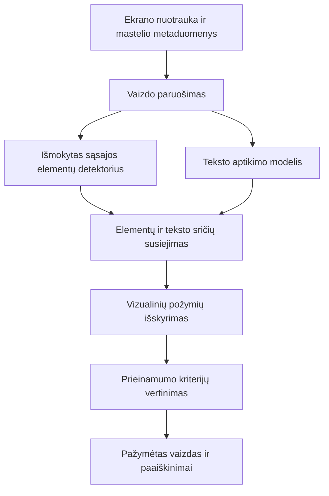

1. Apsibrėžk, ką konkrečiai sukursi ir ištirsi
Galutinis praktinis rezultatas būtų sistema, į kurią įkėlus svetainės ekrano nuotrauką:
- aptinkami pasirinkti naudotojo sąsajos elementai;
- nustatomos teksto sritys;
- išskiriamos prieinamumo vertinimui reikalingos vaizdo savybės;
- identifikuojamos galimos prieinamumo problemos;
- probleminės vietos pažymimos vaizde ir paaiškinamos.
Darbo apraše nurodysi, kad nagrinėji iš ekrano vaizdo vertinamus prieinamumo aspektus. Temos pavadinimo keisti nereikia: konkrečią tyrimo apimtį apibrėžia tikslas, uždaviniai ir metodika.
Tavo pagrindinis indėlis būtų parengti duomenys, pritaikyti ir palyginti modeliai, prieinamumo vertinimo metodika bei eksperimentais nustatytos sistemos galimybės ir ribotumai.
2. Suformuluok darbo tikslą ir uždavinius
Siūlomas darbo tikslas:
Sukurti ir eksperimentiškai įvertinti sistemą, kuri, taikydama mašininio mokymosi ir kompiuterinės regos metodus, analizuoja svetainių ekrano nuotraukas ir identifikuoja pasirinktas naudotojo sąsajos prieinamumo problemas.

Siūlomas tyrimo objektas:
Mašininio mokymosi ir kompiuterinės regos metodų taikymas naudotojo sąsajos elementams ir prieinamumo problemoms aptikti svetainių ekrano nuotraukose.

Siūlomi uždaviniai:
1. Išanalizuoti pasirinktus prieinamumo kriterijus ir esamus automatizuoto vertinimo metodus.
2. Išnagrinėti naudotojo sąsajos elementų aptikimo metodus ir pasirinkti lyginamus modelius.
3. Parengti mokymo, validavimo ir testavimo duomenis bei jų anotavimo taisykles.
4. Pritaikyti ir papildomai išmokyti pasirinktus modelius sąsajos elementams aptikti.
5. Įgyvendinti vizualinių požymių išskyrimą ir pasirinktų prieinamumo problemų vertinimą.
6. Atlikti modelių ir visos sistemos eksperimentinį vertinimą.
7. Sukurti demonstracinį prototipą ir suformuluoti rezultatais pagrįstas išvadas.
Šias formuluotes pradžioje aptari su vadovu. Darbo pabaigoje patikrini, ar kiekvienam uždaviniui yra konkretus rezultatas.
3. Iš anksto numatyk tyrimo klausimus
Siūlau keturis susijusius klausimus:
Klausimas	Kaip į jį atsakysi
T1. Kaip tiksliai pasirinkti modeliai aptinka sąsajos elementus?	Palyginsi modelių aptikimo kokybę, lokalizavimo paklaidą ir greitį
T2. Kaip mokymo duomenų sudėtis veikia rezultatą realiose svetainėse?	Palyginsi mokymą sintetiniais ir mišriais duomenimis
T3. Kaip elementų aptikimo klaidos veikia prieinamumo problemų nustatymą?	Palyginsi analizę naudojant etalonines ir modelio prognozuotas elementų sritis
T4. Kokią papildomą informaciją sistema suteikia šalia esamo prieinamumo tikrinimo įrankio?	Palyginsi patvirtintus savo sistemos ir „axe-core“ rezultatus

T1–T3 sudarytų pagrindinę mašininio mokymosi tyrimo dalį. T4 parodytų praktinę sistemos vertę.
Tikslas būtų nustatyti, kokiomis sąlygomis metodas veikia ir kur klysta. Teiginį, kad jis pranašesnis už esamus įrankius, galėtum pateikti tik tada, jeigu tai parodytų rezultatai.
4. Pasirink ribotą, bet prasmingą problemų rinkinį
Siūlau pradėti nuo dviejų problemų grupių:
Problemų grupė	Reikalinga informacija	Vertinimo ribos
Galimai nepakankamas teksto kontrastas	Teksto vieta, teksto ir fono spalvų įverčiai	Sudėtingi fonai, antialiasingas ir teksto dydžio nustatymas kelia neapibrėžtumą
Galimai per maži arba nepakankamai atskirti interaktyvūs elementai	Elementų vietos, matmenys, tarpai ir vaizdo mastelis	Matomas kontūras gali nesutapti su tikrąja paspaudimo sritimi

Kontrasto dalyje WCAG 1.4.3 numato 4,5:1 santykį įprastam tekstui ir 3:1 dideliam tekstui, taip pat išimtis. W3C atkreipia dėmesį, kad antialiasingas gali pakeisti ekrane matomas spalvas, todėl rastrinis įvertis ir norminis kontrasto patikrinimas nėra automatiškai tapatūs. W3C kontrasto paaiškinimas.
Dydžio dalyje WCAG 2.2 kriterijus 2.5.8 nustato 24 × 24 CSS pikselių reikalavimą su išimtimis, įskaitant tarpų sąlygą. Todėl vien palyginti rėmelio plotį su skaičiumi 24 nepakaks. W3C dydžio ir tarpų paaiškinimas.
Persidengimus, nukirstą tekstą ar kitus vizualinius defektus palik galimiems plėtiniams. Vien geometrinis persidengimas nebūtinai reiškia prieinamumo problemą.
Šio etapo rezultatas: lentelė, kurioje kiekvienai pasirinktai problemai aprašyta, kokių duomenų reikia, kaip ji vertinama ir kada sistema turi pateikti „nepakanka informacijos“.
5. Atlik literatūros ir esamų sprendimų analizę
Literatūros analizę organizuok pagal darbo sprendimus, kuriuos reikės priimti:
- Prieinamumo vertinimas: pasirinkti WCAG kriterijai, automatizavimo galimybės ir ribos.
- Objektų aptikimas: kaip modeliai lokalizuoja ir klasifikuoja sąsajos elementus.
- Teksto aptikimas ir vaizdo analizė: teksto sritys, spalvų atskyrimas, fonų sudėtingumas.
- Duomenys: vieši UI rinkiniai, sintetiniai duomenys, anotacijų kokybė.
- Eksperimentinis vertinimas: metrikos, duomenų skaidymas, modelių palyginimas.
Pradžiai naudingi šaltiniai būtų „WebUI“ mokslinis darbas, „UIED“ autorių projektas, pasirinkto objektų detektoriaus straipsnis ir dokumentacija, W3C kriterijų aprašai bei „axe-core“ dokumentacija.
Kiekvienam svarbesniam šaltiniui užpildyk trumpą lentelės eilutę: problema, metodas, duomenys, vertinimas, ribotumai ir pritaikomumas tavo darbui.
Kaip orientyrą siūlau 15–25 tikslingai pasirinktus šaltinius. Tai nėra fakulteto nustatytas minimumas. Svarbiausia, kad iš analizės būtų aišku, kodėl pasirinkai būtent tokią tyrimo metodiką.
6. Suprojektuok sistemą ir aiškiai atskirk jos komponentus
Siūloma architektūra:

Mašininis mokymasis čia atlieka esminę užduotį: iš pikselių nustato, kur ir kokie elementai yra. Kompiuterinės regos algoritmai padeda įvertinti jų vizualines savybes, o taisyklės susieja jas su pasirinktais prieinamumo kriterijais.
Pradinis modelių pasirinkimas galėtų būti YOLOv8n ir YOLOv10n. Tai būtų dvi konkrečios lyginamos objektų aptikimo architektūros, atitinkančios tavo pradinę idėją. Galutinį pasirinkimą priimk po piloto, patikrinęs jų mokymo galimybes savo aplinkoje. YOLOv8 dokumentacija, YOLOv10 dokumentacija.
Pradžioje pasirink 2–3 grafinių komponentų klases, pavyzdžiui, mygtuką, įvesties lauką ir žymimąjį langelį. Tekstą aptik atskiru pasirinktu modeliu, vienodu abiem palyginimo variantams.
Bendros paskirties modelio svoriai būtų pradinis taškas papildomam mokymui. Tavo tyrime modelis turėtų būti pritaikytas pasirinktoms UI klasėms.
Šio etapo rezultatas: sistemos schema, komponentų įvestys ir išvestys, pasirinktos elementų klasės.
7. Atlik pilotinį bandymą
Prieš rengdamas visą duomenų rinkinį, surink apie 20–30 skirtingų ekranų ir rankiniu būdu pažymėk pasirinktus elementus.
Per pilotą:
1. Paruošk vaizdus ir jų anotacijas.
2. Paleisk trumpą vieno modelio papildomą mokymą.
3. Patikrink, ar teisingai perskaitomos klasės ir koordinatės.
4. Išbandyk teksto aptikimą.
5. Apskaičiuok kelių elementų dydžius ir teksto sričių kontrasto įverčius.
6. Sugeneruok pirmą pažymėtą ekrano nuotrauką.
Šiame etape užrašyk, kiek užtrunka vieno ekrano anotavimas, kiek atminties reikia modeliui ir kiek trunka mokymo bandymas.
Piloto paskirtis – patikrinti visą darbo eigą ir darbo sąnaudas. Patikimų išvadų apie modelio kokybę iš tokios mažos imties dar nedarysi.
Jei smulkūs elementai dingsta sumažinus visą vaizdą, išbandyk didesnę įvesties raišką arba vaizdo skaidymą į dalis. Prieš matuodamas elementų dydžius ir tarpus, koordinates visuomet grąžink į originalaus vaizdo sistemą.
8. Parenk pagrindinį duomenų rinkinį
Duomenis siūlau sudaryti iš kontroliuojamų ir realių pavyzdžių.
Kontroliuojami pavyzdžiai – tavo sukurti puslapiai, kuriuose gali keisti elementų dydžius, išdėstymą, spalvas, fonus ir teksto parametrus. Jie leidžia automatiškai gauti dalį anotacijų ir tiksliai žinoti įterptas problemas.
Realūs pavyzdžiai – skirtingų svetainių ekranai, skirti modelio veikimui tikroviškose sąsajose patikrinti. Jie turi apimti ir problemų turinčius, ir tinkamai atrodančius elementus.
Po piloto pradinis orientyras galėtų būti 300–600 kontroliuojamų ekranų ir 80–120 realių ekranų. Kiekį koreguok pagal anotavimo laiką, klasių pasiskirstymą ir mokymosi kreives. Šie skaičiai negarantuoja pakankamos modelio kokybės.
Kiekvienam ekranui saugok:
Duomenys	Paskirtis
Vaizdas ir unikalus identifikatorius	Analizės įvestis
Svetainės arba šablonų šeimos identifikatorius	Apsauga nuo mokymo ir testavimo duomenų persidengimo
Naršyklės būsena, ekrano dydis ir vaizdo mastelis	Atkuriamumas ir matmenų perskaičiavimas
Elementų klasės ir rėmeliai	Detektoriaus mokymas bei vertinimas
Prieinamumo problemų žymos	Galutinės sistemos vertinimas
Žymos pagrindimas ir neapibrėžtumas	Etaloninių atsakymų patikimumas

Atskirk dviejų rūšių anotacijas: „čia yra mygtukas“ ir „šis elementas turi konkrečią prieinamumo problemą“. Tai skirtingos užduotys.
Mokymo, validavimo ir testavimo duomenis skirstyk pagal svetaines ir šablonų šeimas. To paties puslapio spalviniai, mobilieji ar iškarpų variantai turi likti vienoje dalyje. Galutiniam realių svetainių testui siek turėti atskirą rinkinį, pavyzdžiui, 30–50 ekranų iš bent 10 mokyme nenaudotų svetainių.
DOM ir CSS gali padėti parengti etalonines žymas. Tačiau prognozavimo metu vizualinis modelis jų neturi gauti, jei tiri analizę pagal ekrano nuotrauką. Automatiškai sugeneruotus rėmelius patikrink dėl nematomų ar uždengtų elementų.
Jei įmanoma, nedidelę anotacijų dalį duok nepriklausomai patikrinti kitam vertintojui. Jei tokios galimybės nėra, tai įvardyk kaip ribotumą.
9. Išmokyk ir palygink modelius
Pradėk nuo vieno modelio ir sutvarkyk visą mokymo eigą. Tik tada tokiu pačiu duomenų formatu paleisk antrąjį.
Siūloma mokymo seka:
1. Užfiksuok duomenų rinkinio ir programinės aplinkos versijas.
2. Pasirink pradinius svorius, įvesties raišką ir mokymo nustatymus.
3. Paleisk pradinį mokymą.
4. Išanalizuok validavimo rezultatus ir klaidų pavyzdžius.
5. Atlik ribotą, iš anksto suplanuotą parametrų paiešką.
6. Pasirink geriausią variantą pagal validavimo rezultatus.
7. Užfiksuok nustatymus prieš galutinį testavimą.
Abiem modeliams naudok tas pačias klases, duomenų dalis ir palyginamą parametrų derinimo biudžetą. Aprašyk pradinių svorių bei mokymo sąlygų skirtumus.
Svarbūs mokymo metu nagrinėjami klausimai: ar modelis nepersimoko, kurių klasių elementus praleidžia, ar tiksliai lokalizuoja mažus objektus ir kaip keičiasi rezultatai didinant duomenų kiekį.
Duomenų transformacijas rinkis atsargiai. Spalvų keitimas gali būti naudingas elementų detektoriui mokyti, tačiau pakeičia kontrastą. Galutinį prieinamumo vertinimą atlik originaliuose vaizduose arba iš naujo apskaičiuok transformuotų pavyzdžių žymas.
Jeigu skaičiavimo ištekliai leidžia, svarbiausius mokymus pakartok su trimis atsitiktinėmis sėklomis ir pateik rezultatų sklaidą. Mokymo paleidimo trukmę planuok atskirai nuo aktyvaus savo darbo laiko.
Šio etapo rezultatas: modelių svoriai, mokymo konfigūracijos, mokymosi kreivės ir validavimo palyginimas.
10. Įgyvendink požymių išskyrimą ir prieinamumo vertinimą
Po elementų aptikimo kiekvienai sričiai apskaičiuok pasirinktus požymius:
- plotį, aukštį ir plotą;
- atstumą iki artimiausio galimai interaktyvaus elemento;
- teksto srities ir komponento ryšį;
- teksto ir fono spalvų įverčius;
- kontrasto santykio įvertį;
- prireikus vietinį elementų tankį.
Tankį naudok kaip analitinį požymį – vien tankus išdėstymas nėra pažeidimo įrodymas.
Kontrasto dalyje pradėk nuo vienalyčio fono. Kai šis atvejis veikia, pereik prie gradientų ir paveikslėlių. Turi būti aišku, kaip atskiri teksto bei fono pikselius ir ką darai, jei patikimai jų atskirti nepavyksta.
Dydžių dalyje būtinas patikimas mastelis. Savavališkai sumažinta ekrano nuotrauka be metaduomenų neleidžia patikimai apskaičiuoti CSS matmenų. Kontroliuojamuose pavyzdžiuose galėsi žinoti tikrąją paspaudimo sritį; realiuose vaizduose dažnai galėsi pateikti tik perspėjimą.
Sistemos išvadas siūlau skirstyti į tris būsenas:
Aptikta galima problema; pagal turimą informaciją problemos neaptikta; patikimam vertinimui nepakanka informacijos.
Objektų detektoriaus pasitikėjimo balo nepateik kaip tikimybės, kad elementas pažeidžia standartą. Tai skirtingi įverčiai.
11. Atlik keturis pagrindinius eksperimentus
Eksperimentas	Palyginimas	Pagrindinis rezultatas
E1. Modelių palyginimas	Du detektoriai, naudojant tą patį mokymo rinkinį	Aptikimo kokybės ir greičio skirtumai
E2. Duomenų sudėties įtaka	Pasirinktas modelis su sintetiniais ir mišriais duomenimis	Gebėjimas veikti realiose svetainėse
E3. Aptikimo klaidų poveikis	Prieinamumo analizė su etaloniniais ir prognozuotais rėmeliais	Kiek galutinių klaidų sukelia detektorius
E4. Palyginimas su „axe-core“	Tos pačios puslapių būsenos ir vertinami kriterijai	Papildomi patvirtinti radiniai ir klaidingi perspėjimai

E2 eksperimente kontroliuok bendrą mokymo duomenų kiekį, jeigu nori daryti išvadą būtent apie jų sudėtį. Jei mišrus rinkinys tiesiog didesnis, rezultatas atspindės ir duomenų kiekio poveikį.
E3 yra ypač svarbus: geras objektų aptikimo rodiklis dar negarantuoja gero prieinamumo vertinimo. Nedidelė lokalizavimo klaida gali pakeisti sprendimą prie dydžio ar kontrasto ribos.
„axe“ jau turi kontrasto ir paspaudimo sričių tikrinimus. Todėl E4 vertinsi papildomą naudą konkrečiais atvejais. Išsaugok ir incomplete rezultatus: jie reiškia, kad reikia papildomo vertinimo, o ne kad problemos nėra. „axe“ kontrasto taisyklė, dydžio taisyklė.
Vertinimui naudok:
Vertinimo lygis	Rodikliai
Elementų aptikimas	Precision, Recall, mAP@0.5, mAP@0.5:0.95, rezultatai pagal klasę
Geometrija	Pločio ir aukščio absoliuti paklaida CSS pikseliais, kai mastelis žinomas
Prieinamumo problemų aptikimas	Precision, Recall, F1 pagal problemos tipą
Neapibrėžtumas	Neįvertintų atvejų dalis ir jų priežastys
Veikimo sąnaudos	Analizės laikas vienam vaizdui nurodytoje aparatinėje aplinkoje

Prieš testą apibrėžk, kaip prognozė susiejama su etalonine problema: problemos tipas, elementas ar sričių persidengimas. Užtikrink, kad ta pati problema nebūtų suskaičiuota kelis kartus.
Neaiškių etaloninių atvejų nepriskirk neigiamiems pavyzdžiams. Pateik jų skaičių atskirai. Rezultatus papildyk klaidų analize pagal elementų dydį, fono tipą ir svetainę. Jei skaičiuosi pasikliautinuosius intervalus, atsižvelk, kad vienos svetainės elementai nėra nepriklausomi stebėjimai.
12. Sukurk demonstracinį prototipą
Prototipui pakaktų paprastos žiniatinklio sąsajos:
Įkelti vaizdą → paleisti analizę → matyti pažymėtas sritis → pasirinkti perspėjimą → peržiūrėti paaiškinimą → eksportuoti rezultatus.
Prie rezultato pateik problemos tipą, išmatuotas savybes, susijusį kriterijų ir neapibrėžtumo paaiškinimą. Perspėjimus atskirk ne vien spalva, bet ir tekstu arba simboliais.
Įtrauk kelis paruoštus demonstracinius pavyzdžius ir trumpą paleidimo instrukciją. Naršyklės įskiepį palik plėtiniui, jei pagrindinis tyrimas jau baigtas.
Šio etapo rezultatas: recenzentui paleidžiama sistema, kuri parodo visą tavo metodą nuo vaizdo iki ataskaitos.
13. Darbo tekstą rašyk lygiagrečiai su įgyvendinimu
Siūloma pagrindinės dalies struktūra:
Darbo dalis	Siūlomi poskyriai	Orientacinė apimtis
Įvadas	Aktualumas, problema, objektas, tikslas, uždaviniai, indėlis, darbo struktūra	2–3 psl.
1. Prieinamumo vertinimo ir susijusių metodų analizė	Pasirinkti kriterijai; esami įrankiai; UI aptikimo metodai; susijusių darbų palyginimas	6–7 psl.
2. Tyrimo metodika ir duomenys	Tyrimo klausimai; duomenų šaltiniai; anotavimas; skaidymas; modeliai; metrikos	6–7 psl.
3. Sistemos projektavimas ir įgyvendinimas	Architektūra; modelių mokymas; požymių išskyrimas; vertinimo taisyklės; prototipas	6–7 psl.
4. Eksperimentai ir rezultatų analizė	E1–E4; klaidų analizė; rezultatų patikimumas ir ribotumai	8–10 psl.
Išvados ir rekomendacijos	Atsakymai į tyrimo klausimus, praktinio taikymo rekomendacijos	1–2 psl.
Ateities tyrimų gairės	Pagrįstos plėtros kryptys	Apie 1 psl.

Pridėk titulinį puslapį, turinį, prireikus terminų sąrašą, anotacijas lietuvių ir anglų kalbomis, literatūros sąrašą ir priedus. Laikykis pateiktame dokumente nustatytos dalių eilės.
Pagal PDF lietuviška anotacija turėtų būti apie 100 žodžių, angliška – nuo pusės iki vieno puslapio. Darbo tekstas ir iliustracijų paaiškinimai rašomi viena pasirinkta kalba, išskyrus anotaciją kita kalba. Pagrindiniame tekste algoritmus aiškink schemomis ir pseudokodu; programos kodui numatyti priedai ir pateikiami išeities failai.
Aiškiai aprašyk, kokias bibliotekas, modelius ir kitų autorių sprendimus panaudojai bei ką įgyvendinai pats.
Išvadose pateik rezultatų reikšmę, o ne vien atliktų veiksmų sąrašą. Pavyzdžiui: kokiems elementams modelis tiko geriausiai, ar realūs duomenys pagerino apibendrinimą ir kokia galutinių perspėjimų dalis buvo klaidinga. Skaitines reikšmes įrašysi gavęs rezultatus.
14. Paskirstyk 400 valandų ir stebėk pažangą
Veikla	Valandos	Etapo rezultatas
Temos ribos, tikslas ir tyrimo planas	15	Su vadovu aptartas darbo aprašas
Literatūros ir standartų analizė	35	Palyginimo lentelė ir pagrįsta metodika
Pilotinis bandymas	20	Veikianti minimali analizės eiga
Duomenų rinkimas, generavimas ir anotavimas	60	Patikrintas duomenų rinkinys
Modelių mokymas ir parametrų derinimas	65	Parengti lyginami modeliai
Požymių ir prieinamumo vertinimo įgyvendinimas	40	Veikiantis vertinimo modulis
Eksperimentai ir rezultatų analizė	50	Lentelės, grafikai ir klaidų analizė
Demonstracinis prototipas	20	Naudojama sąsaja
Rašymas ir redagavimas viso proceso metu	60	Galutinis darbo tekstas
Pateikimo paketas ir pasirengimas gynimui	15	Failai, skaidrės ir repeticijos
Rezervas	20	Nenumatyti sunkumai
Iš viso	400	

Jei darbui skirtum vidutiniškai 25 valandas per savaitę, tai būtų 16 savaičių. Siūlomi kontroliniai taškai:
Laikotarpis	Ką turėtum turėti
1–2 savaitė	Aiški apimtis, literatūros analizės pagrindas, pradėtas pilotas
3–4 savaitė	Baigtas pilotas, anotavimo taisyklės, veikiantis duomenų parengimas
5–6 savaitė	Pagrindinis duomenų rinkinys ir pirmas modelis
7–8 savaitė	Abu modeliai ir validavimo palyginimas
9–10 savaitė	Visa prieinamumo vertinimo eiga, užfiksuota eksperimentų metodika
11–12 savaitė	Galutiniai eksperimentai ir prototipas
13–14 savaitė	Visa rezultatų analizė ir pilnas darbo juodraštis
15–16 savaitė	Vadovo pastabų taisymai, pateikimas ir pasirengimas gynimui

Rašymo valandas paskirstyk per visas savaites. Kas dvi savaites vadovui parodyk konkretų rezultatą: duomenų pavyzdžius, modelių palyginimą, metodikos tekstą arba eksperimentų lentelę.
Jei pradedi atsilikti, pirmiausia mažink papildomų elementų klasių, papildomų modelių ir sąsajos funkcijų skaičių. Išsaugok nepriklausomą testavimą, rezultatų analizę ir laiką tekstui.
15. Parenk galutinį pateikimą ir gynimą
Pateikimo pakete numatyk darbo PDF ir redaguojamą šaltinį, programos kodą, modelių svorius arba aiškią jų gavimo instrukciją, aplinkos versijas, demonstracinius duomenis, paleidimo instrukciją ir eksperimentų konfigūracijas.
Tavo pateiktame PDF nurodyti SKAITYK.txt, doc/, bin/ ir src/ katalogai, taip pat spausdintų egzempliorių ir laikmenos reikalavimai. Jų taikymą savo gynimo laikotarpiui pasitikrink pagal katedros einamųjų metų pranešimus.
Pagal dokumentą bakalauro pristatymui skiriama iki 10 minučių, o skaidrės privalomos. Pristatymą gali paskirstyti taip:
- problema, tikslas ir uždaviniai – apie 1 minutę;
- duomenys ir metodika – apie 2 minutes;
- modeliai ir sistemos veikimas – apie 2 minutes;
- eksperimentiniai rezultatai – apie 3 minutes;
- išvados ir ribotumai – apie 1 minutę.
Likusi minutė būtų rezervas. Jei demonstruosi prototipą, demonstraciją įtrauk į šį laiką.
Pasiruošk atsakyti, ką modelis išmoko, kodėl pasirinkai tokius duomenis, kaip išvengei mokymo ir testo persidengimo, kaip nustatei etalonines problemas ir kodėl geresnis detektorius ne visada reiškia geresnį prieinamumo vertinimą.
Pirmas konkretus tavo darbo etapas: per pirmąsias 20–25 valandas parengti vieno puslapio tyrimo aprašą, pasirinkti pradines elementų klases ir dvi problemų grupes, surinkti 20–30 pilotinių ekranų, sužymėti dalį jų ir pradėti pirmą modelio mokymo bandymą. Jo rezultatai leis galutinai patikslinti duomenų apimtį ir mokymo planą.
